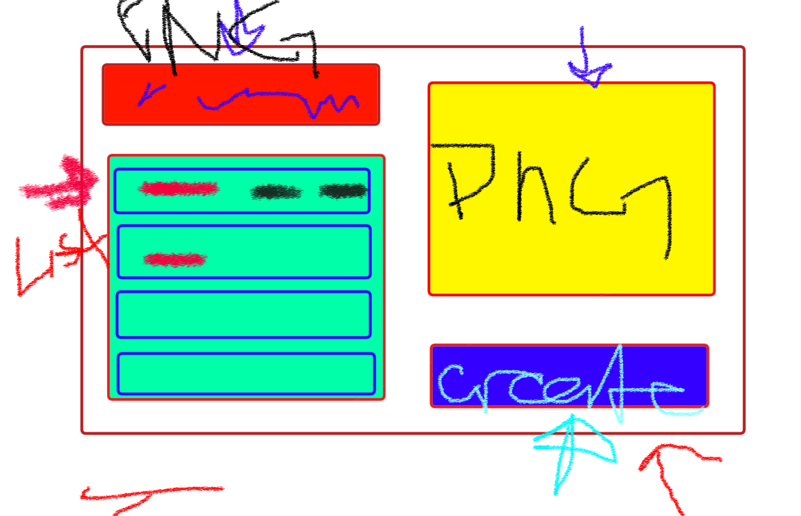
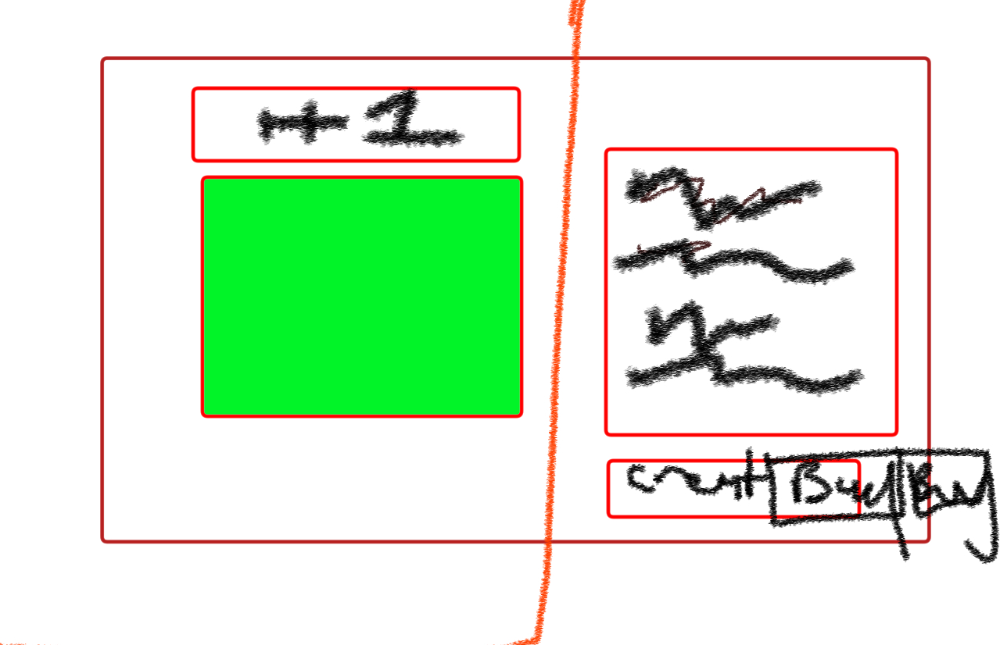
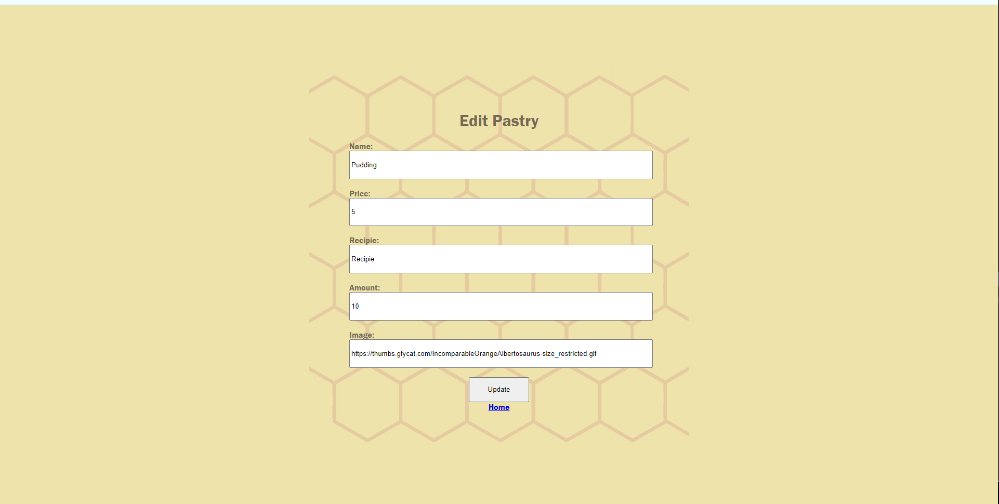

# BibalaHoney

----------
This is a sweetss store fan by a bubbly honey bee named Biba! She is super friendly and loves to cook! In her store you can help her with the recipies and even help her sell things.

----------

## Getting started / Prerequistes

### Assets
-
-
-
-

### Spcial link inserts (pastrydatautilites)

- https://64.media.tumblr.com/074e8ff016883193ffe263b60eb801d1/tumblr_ncq0rwdjLx1snc5kxo1_500.gifv

- https://i.pinimg.com/originals/3e/53/b8/3e53b85ec1dfc96bc7e9dba3453ccd4b.gif

- https://i.pinimg.com/originals/b1/65/60/b165600641ee446246745a9316ff7f1f.gif
- https://thumbs.gfycat.com/IncomparableOrangeAlbertosaurus-size_restricted.gif
----------

### Create these files and folders

- server.js
- .env
- .gitignore ( move created .env and node_modules/ into here)

- (folder) views (for react jsx files)
   -- Index.jsx
   -- Show.jsx
- (folder) model (for js/ schemas)
    --honey.js
- (folder) public > (folder)CSS > (folder) images
  --(CSS) indexstyle.css , newstyle.css, showstyle.css ( to connect to views)

- (folder) utilities
  --pastrydata.js (seed fill array)

### Instals in the Node terminals

- npm init -y
- npm i express (dependecy)
- npm i dotenv
- npm install express-react-views react@16 react-dom@16 --save
- npm i method-override
- npm i mongoose

----------

## Installing / Attempts / bugs
------
### .env

- type: PORT=3000

### Server.js starter
1. type: const express = require('express')

2. const app = express()

3. const port = process.env.PORT || 3003

4. app.listen(port, () => {
    console.log(`listening on http://localhost:${port}`)}) (must stay at the bottom)

5. app.set('view engine', 'jsx')

6. app.engine('jsx', require('express-react-views').createEngine())

7. require('dotenv').config()

8. app.use(express.urlencoded({ extended: true }));

9. app.use(methodOverride('_method'))

10. in terminal type nodemon to test,  in internet browser type localhost:3000/ OR ctrl click the localhost in terminal

11. type: const Honey = require('./model/honey.js') to connect your model/js to ther server

12. app.get('/biba', (req, res) => { 
    -res.render('Index', {honey: honey})
  - })

13. app.get('/biba/new', function (req,res){ 
    //form to create a new pokemon
    res.render('New') (to make a new pastry)
- })

14. app.get('/biba/:id', function(req, res){
   
    }) (to delete and destroy)

15. app.use(express.static('public'))

### Index.jsx

### Mongoose

- MongoDB
- Create new project (free)'
- New Cluster name
- Username and pasword for database
- scroll down for current IP address > confirm
- side bar left> Network Access> EDIT> allow acces fron anywhere > confirm
- Atlas>Connect>Connect your Application
- Copy and paste the code into your .env
- replace '<password>' in mongoose .env code with password you created
- npm i mongoose in Terminal
-  Type in server top: 
- const mongoose = require('mongoose')
- mongoose.connect(process.env.MONGO_URI || 'mongo://localhost:3003/biba', { useNewUrlParser: true })
        .then(connect => console.log('connected to mongo..'))
        .catch(e => console.log('could not connect to mongo', e))

        const methodOverride = require('method-override')

- In Honey.js(model) at top type: const mongoose = require('mongoose')

### Heroku
- So app can work aestheiclly 
- node -v
- make sure heroku is installed ( in terminal: npm i heroku)
- heroku  create (name)
- settings > reveal > key = MONGO URI, URL info in .env
- update in package. json of latest node
- Add to Package.json below versions: 
  "engines": {
    "node": "14.17.0"
  },
- git remote - v
- git add .
- git commit -m "note"
- git push heroku main

#### Heroku.com
- Got to Heroku.com
- (click name made) > settings > Reveal Config Vars >
- MONGO URI (KEY)
- (link ONLY from MONGODB) (VALUE)
- (add, commit, push again just in case)

### server.js
Below installions on server.js
- const pastryData = require('./utilities/pastrydata.js')
- const Pastry = require('./model/honey.js')

Between this and bottom port console log must be in this order. Function will be filled with references to views models and utilites

1. app.get('/biba', (req, res) => { (Index called and empty schma made here)})
2. app.post('/biba', (req, res) => { })
3. app.get('/biba/seed', (req,res) => {})
4. app.get('/biba/new', function (req,res){ (New renderd here) })
5. app.get('/biba/:id/edit', function(req, res){ (edit correction here)})
6. app.get('/biba/:id', function(req, res){(show view)})
7. app.delete('/biba/:id', function(req, res){(delete, redirect here})

## JSX Skeleton ( Index, Edit, Show, New)
const React = require('react')

    class Index extends React.Component {
      render() {
          return (
            <html lang="en">
            <head>
              <meta charset="UTF-8" />
              <meta http-equiv="X-UA-Compatible" content="IE=edge" />
              <meta name="viewport" content="width=device-width, initial-scale=1.0" />
              <title>CAFE</title>
              <link rel="stylesheet" href="/CSS/indexstyle.css"></link>
            </head>
            <body>
            

                  

            </body>
            </html>

          )
      }
    }
    module.exports = Index

- In each Jxs the react is required so t can be called and a class that the module can export it so make sure the names match up. Otherwise you can fill the return () with a html boilerplate the responts to the post which makes it able to appear in the browers online.
---------------

## Schema
- model > honey.js ( this makes and empty object to be filled)
- honey.js: 
const mongoose = require('mongoose')
const pastrySchema = new mongoose.Schema({ 
    name: { type: String, required: true},
    price:{type: Number, required: true},
    text:{type: String, required: true},
    total:{type: Number, required: true},
    img:{type: String, required: false},
})
const Pastry = mongoose.model('Pastry', pastrySchema)
 module.exports = Pastry

- model > mongo :
const mongoose = require('mongoose')

mongoose.connect(process.env.MONGODB_URI || 'mongodb://localhost:3003/biba', { useNewUrlParser: true })
        .then(connect => console.log('connected to mongodb..'))
        .catch(e => console.log('could not connect to mongodb', e))

module.exports = {mongoose}

 - (so mongo can be called)

## Utilities
- utilities > pastryData.js:
const pastryData = [
    {name: "Strawberry Cheesecake", price:5, total: 10, text:'Lorem, ipsum dolor sit amet consectetur adipisicing elit. Incidunt magni aliquam beatae ea quae nihil excepturi est cupiditate earum nobis, voluptatem reprehenderit sapiente molestiae facilis labore rerum exercitationem id veritatis', img: "https://i.pinimg.com/originals/3e/53/b8/3e53b85ec1dfc96bc7e9dba3453ccd4b.gif"},
    {name: "Cup Cake",  price:5, text:'Recipie', total: 10,img: "https://64.media.tumblr.com/074e8ff016883193ffe263b60eb801d1/tumblr_ncq0rwdjLx1snc5kxo1_500.gifv"},
    {name: "Strawberry Roll", price:5, text:'Recipie', total: 10, img: "https://i.pinimg.com/originals/b1/65/60/b165600641ee446246745a9316ff7f1f.gif"},
    {name: "Pudding", price:5, text:'Recipie', total: 10, img: "https://thumbs.gfycat.com/IncomparableOrangeAlbertosaurus-size_restricted.gif"},
 ]

 module.exports = pastryData

- ( this is information that would already exist, you can update the url and information how you see fit.)

## CSS

- Index WireFrame

- Show wireframe

- Edit / New reference

---------
## Goals / Lessons / Thank Yous~
---------
This project was very difficult, but now knowing that I'm capable to have a functioning website from scratch is a skill I never thought I would ever be. The goal is to touch up the format, art, and stylize the buttons. Also I aim to simply organize the syntax and find a way to make the process as simple as it gets. All in all, I've learned pacitence and comradery. I'm so greatful to have such a friendly class and intuitive professor and assistant. Excited for more to learn.